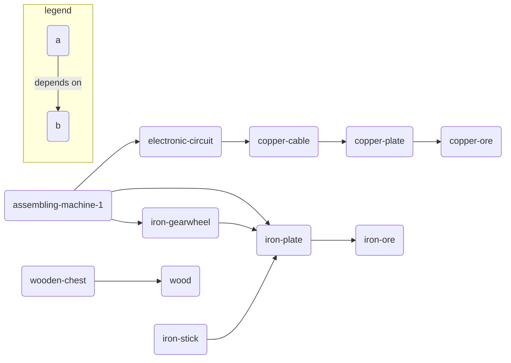

# Package Graph

A set of public npm packages designed for testing various edge cases with
package managers. It's a directed acyclic graph (DAG) of packages with no
actual code. The value is in the relationship of the packages and various
published semver versions.

The packages are published on public npm under the `@pg1` scope. For example:
```
npm add @pg1/iron-plate
```



Each package is published at three versions: `1.0.0`, `1.1.0`, and `2.0.0`.
Each respspective version depends on its dependencies at the corresponding
version with the `^` specifier. For example, `@pg1/iron-plate` at version `2.0.0`
depends on `@pg1/iron-ore@^2.0.0`.

## Maintainer notes

See the `generate-packages.js` file for more details on how the packages are
generated.

Publish process:
- `pnpm install`
- `npm login`
- `node generate-packages.js`
- `./publish.sh`
